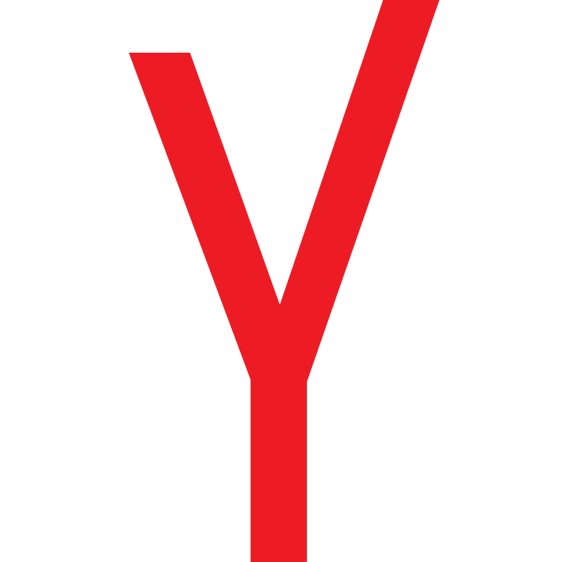

# ✌ Привет, Я Владимир!

- Я младший фронтенд разработчик.
- Самоучка.
- Хочу делать жизнь людей лучше!
- Считаю, что удобный и дружелюбный интерфейс - залог хорошего продукта.

---
## Стек технологий:

    
    
    
    
    
    
    
    
    
    
    
    
    
    

---
## Контакты:

---

## Статистика:

